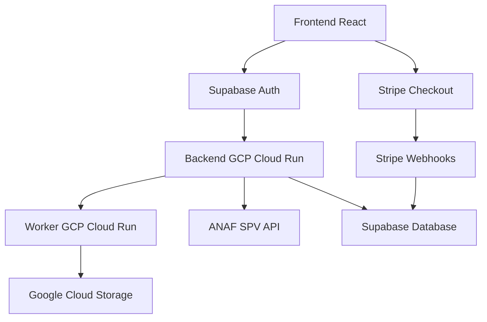

# 🚀 InvoiceHUB Cloud

<div align="center">

**Platformă modernă pentru gestionarea automată a facturilor și documentelor fiscale, cu integrare completă ANAF SPV și Stripe.**

[](https://opensource.org/licenses/MIT)
[](https://reactjs.org/)
[](https://www.python.org/)
[](https://cloud.google.com/)
[](https://supabase.com/)
[](https://stripe.com/)

[🌐 Demo Live](https://invoicehub.tech) • [📖 Documentație](https://github.com/28VYK/invoicehub-cloud/wiki) • [🐛 Raportează Bug](https://github.com/28VYK/invoicehub-cloud/issues)

</div>

---

## 📋 Cuprins

- [🌟 Despre InvoiceHUB](#-despre-invoicehub)
- [✨ Caracteristici](#-caracteristici)
- [🛠️ Stack Tehnologic](#️-stack-tehnologic)
- [🚀 Instalare Rapidă](#-instalare-rapidă)
- [📖 Utilizare](#-utilizare)
- [🏗️ Arhitectură](#️-arhitectură)
- [🔧 API Reference](#-api-reference)
- [🤝 Contribuții](#-contribuții)
- [📄 Licență](#-licență)
- [📞 Suport](#-suport)

---

## 🌟 Despre InvoiceHUB

InvoiceHUB este o platformă cloud B2B care revoluționează gestionarea facturilor și documentelor fiscale pentru afaceri românești. Sistemul integrează automat cu Spațiul Privat Virtual (SPV) ANAF, procesează facturi XML, gestionează abonamente și oferă o interfață web modernă și intuitivă.

### 🎯 Problema Rezolvată

Înainte de InvoiceHUB, antreprenorii români pierdeau ore întregi:
- Descărcând manual facturi XML din SPV ANAF
- Procesând documente fiscale individual
- Gestionând abonamente și plăți manual
- Întâmpinând erori în validarea ANAF

### 💡 Soluția Noastră

InvoiceHUB automatizează complet aceste procese:
- **Procesare Automată**: Upload și procesare XML instantanee
- **Integrare ANAF**: Conexiune directă cu SPV pentru validare
- **Management Abonamente**: Stripe integration pentru plăți automate
- **Dashboard Modern**: Interfață web responsive cu dark mode

---

## ✨ Caracteristici

### 🔄 Automatizare Completă
- ✅ Upload și procesare automată a facturilor XML
- ✅ Validare ANAF în timp real
- ✅ Export PDF și Excel automat
- ✅ Notificări în timp real pentru erori

### 💳 Sistem de Plăți Integrat
- ✅ Abonamente Stripe cu webhook-uri
- ✅ Facturare automată lunară (25 RON)
- ✅ Gestionare status abonament în timp real
- ✅ Istoric plăți complet

### 🔐 Securitate și Conformitate
- ✅ Autentificare Supabase cu JWT
- ✅ Criptare end-to-end pentru date sensibile
- ✅ Conformitate GDPR pentru date personale
- ✅ Row Level Security în baza de date

### 🎨 Experiență Utilizator Modernă
- ✅ Interfață web responsive (mobile-first)
- ✅ Dark mode complet implementat
- ✅ Animations smooth cu Framer Motion
- ✅ Loading states și error boundaries

### 📊 Dashboard Analitic
- ✅ Statistici în timp real
- ✅ Istoric procesări detaliat
- ✅ Export date pentru contabilitate
- ✅ Monitorizare performanță

---

## 🛠️ Stack Tehnologic

### Frontend
```javascript
React 18.2.0          // Framework UI modern
Vite 5.4.19          // Build tool ultra-rapid
TailwindCSS 3.x      // Utility-first CSS
Framer Motion 12.23.5 // Animations smooth
Lucide React 0.525.0 // Icon system consistent
```

### Backend & Cloud
```python
Python 3.11           // Runtime performant
Flask 2.3.0          // Micro-framework API
GCP Cloud Run        // Serverless deployment
Supabase 2.51.0      // Backend-as-a-Service
Stripe 18.3.0        // Payment processing
```

### DevOps & Deployment
```yaml
Docker Compose       // Container orchestration
GitHub Actions       // CI/CD automat
Nginx                // Reverse proxy
Let's Encrypt        // SSL certificates
```

### Database & Storage
```sql
PostgreSQL          // Primary database
Supabase Storage    // File uploads
Firestore          // NoSQL pentru job-uri
Google Cloud Storage // Backup și archive
```

---

## 🚀 Instalare Rapidă

### 📋 Cerințe Sistem
- Node.js ≥ 20.0.0
- Python ≥ 3.11
- Docker & Docker Compose
- Git

### ⚡ Instalare Automată (Recomandat)

```bash
# Clone repository
git clone https://github.com/28VYK/invoicehub-cloud.git
cd invoicehub-cloud

# Instalare dependințe frontend
npm install

# Instalare dependințe backend
cd backend
pip install -r requirements_gcp.txt
cd ..

# Pornire cu Docker
docker-compose up -d

# Acces la aplicație
open http://localhost:3000
```

### 🔧 Instalare Manuală

```bash
# 1. Frontend setup
npm install
npm run dev

# 2. Backend setup (în alt terminal)
cd backend
python app_backend_gcp.py

# 3. Database setup
# Configurează Supabase project
# Rulează migrations
```

---

## 📖 Utilizare

### 🎯 Pentru Utilizatori Finali

1. **Înregistrare**: Creează cont pe [invoicehub.tech](https://invoicehub.tech)
2. **Abonament**: Selectează planul Premium (25 RON/lună)
3. **Upload**: Încarcă facturi XML din SPV ANAF
4. **Procesare**: Sistemul validează și procesează automat
5. **Download**: Descarcă rezultatele în format PDF/Excel

### 👨‍💻 Pentru Dezvoltatori

```javascript
// Exemplu integrare API
import { supabase } from '@/config/supabase'

const uploadInvoice = async (file) => {
  const { data, error } = await supabase.storage
    .from('invoices')
    .upload(`user_${userId}/${file.name}`, file)

  if (error) throw error
  return data
}
```

### 🔧 Configurare Environment

```bash
# .env.local
VITE_SUPABASE_URL=your_supabase_url
VITE_SUPABASE_ANON_KEY=your_anon_key
VITE_STRIPE_PUBLISHABLE_KEY=pk_test_...
STRIPE_SECRET_KEY=sk_test_...
```

---

## 🏗️ Arhitectură



### 🏛️ Componente Principale

#### Frontend Layer
- **React SPA**: Interfață web modernă
- **Vite**: Build tool pentru development rapid
- **TailwindCSS**: Styling utility-first
- **Context API**: State management

#### Backend Layer
- **Flask API**: REST endpoints pentru business logic
- **Supabase**: Database și authentication
- **GCP Cloud Run**: Serverless deployment
- **Worker Service**: Procesare asincronă

#### Integration Layer
- **ANAF SPV**: API pentru validare facturi
- **Stripe**: Payment processing
- **Supabase Storage**: File management
- **Google Cloud Storage**: Backup

---

## 🔧 API Reference

### Authentication Endpoints

```http
POST /auth/login
Content-Type: application/json

{
  "email": "user@example.com",
  "password": "password123"
}
```

### Invoice Processing

```http
POST /api/upload
Authorization: Bearer <jwt_token>
Content-Type: multipart/form-data

file: invoice.xml
```

### Subscription Management

```http
GET /api/subscription/status
Authorization: Bearer <jwt_token>
```

### ANAF Integration

```http
POST /anaf/connect
Authorization: Bearer <jwt_token>

GET /anaf/invoices
Authorization: Bearer <jwt_token>
```

### Webhook Endpoints

```http
POST /webhooks/stripe
Content-Type: application/json
Stripe-Signature: <signature>
```

---

## 🤝 Contribuții

Suntem încântați să primim contribuții! Iată cum poți ajuta:

### 🚀 Cum să Contribui

1. **Fork** proiectul
2. **Creează** un branch feature (`git checkout -b feature/AmazingFeature`)
3. **Commit** schimbările (`git commit -m 'Add some AmazingFeature'`)
4. **Push** la branch (`git push origin feature/AmazingFeature`)
5. **Deschide** un Pull Request

### 📝 Standarde de Cod

- Folosește **ESLint** și **Prettier** pentru JavaScript
- Folosește **Black** pentru Python
- Scrie **teste unitare** pentru funcționalități noi
- Documentează **API endpoints** noi
- Respectă **conventional commits**

### 🐛 Tipuri de Contribuții

- 🐛 **Bug fixes**
- ✨ **New features**
- 📚 **Documentation**
- 🎨 **UI/UX improvements**
- 🧪 **Tests**
- 🔧 **Performance optimizations**

---

## 📄 Licență

Acest proiect este licențiat sub **MIT License** - vezi fișierul [LICENSE](LICENSE) pentru detalii.

```text
MIT License

Copyright (c) 2025 InvoiceHUB

Permission is hereby granted, free of charge, to any person obtaining a copy
of this software and associated documentation files (the "Software"), to deal
in the Software without restriction, including without limitation the rights
to use, copy, modify, merge, publish, distribute, sublicense, and/or sell
copies of the Software, and to permit persons to whom the Software is
furnished to do so, subject to the following conditions:

The above copyright notice and this permission notice shall be included in all
copies or substantial portions of the Software.
```

---

## 📞 Suport

### 📧 Contact

- **Email**: support@invoicehub.tech
- **Website**: [https://invoicehub.tech](https://invoicehub.tech)
- **GitHub Issues**: [Raportează Bug](https://github.com/28VYK/invoicehub-cloud/issues)

### 📚 Documentație

- [📖 Wiki Complet](https://github.com/28VYK/invoicehub-cloud/wiki)
- [🔧 Ghid Dezvoltare](https://github.com/28VYK/invoicehub-cloud/blob/main/.github/CONTRIBUTING.md)
- [🚀 Deployment Guide](https://github.com/28VYK/invoicehub-cloud/blob/main/.github/DEPLOYMENT.md)

### 💬 Comunitate

- **Discord**: [Alătură-te comunității](https://discord.gg/invoicehub)
- **LinkedIn**: [Urmărește-updates](https://linkedin.com/company/invoicehub)
- **Twitter**: [@InvoiceHUB](https://twitter.com/InvoiceHUB)

### 🆘 Probleme Comune

**Q: Nu pot încărca fișiere XML mari?**
A: Verifică limita de upload în configurația Nginx (implicit 25MB).

**Q: Integrarea ANAF nu funcționează?**
A: Asigură-te că ai configurat credențialele ANAF în variabilele de mediu.

**Q: Plățile Stripe nu se procesează?**
A: Verifică webhook-urile în dashboard-ul Stripe și endpoint-ul `/webhooks/stripe`.

---

<div align="center">

**Făcut cu ❤️ pentru antreprenorii români**

[⬆️ Înapoi sus](#-invoicehub-cloud) • [🐛 Raportează Problemă](https://github.com/28VYK/invoicehub-cloud/issues) • [⭐ Dă Star](https://github.com/28VYK/invoicehub-cloud/stargazers)

</div>
